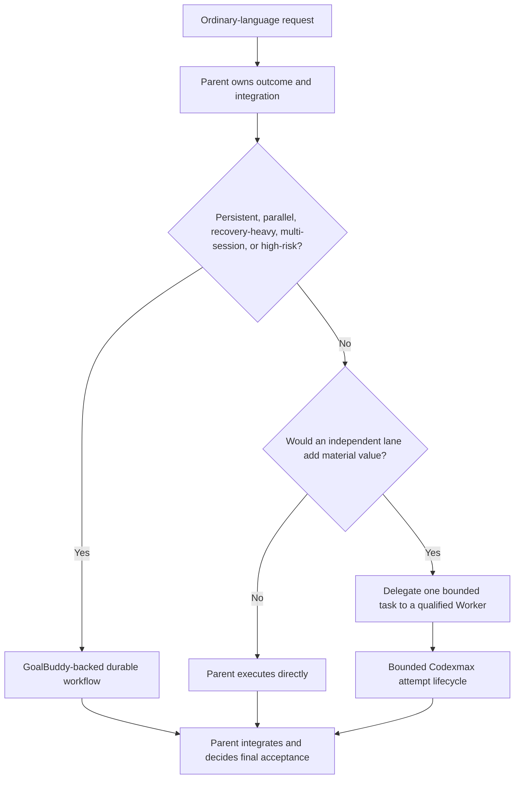

# Guided Journey Contract

## Purpose

`$codexmax-orchestrator:codexmax-orchestrate` is the normal guided front door.
The operator describes an outcome in ordinary language. Codexmax discovers the
local authority and proof context, asks only material questions, shows a concise
execution preview, and generates the detailed orchestration artifacts itself.
The operator is never asked to author an internal goal, assignment, route,
evidence, validation, or closeout packet.

The first-use starter note preserves the original request and keeps native
Codex active. It asks once whether the operator wants to add optional accounts.
`None` is a complete answer. Optional setup cannot block native execution.

This contract defines instructional, template, and progressive-disclosure
behavior. T005 proves this instructional contract and its template behavior
only; it does not implement an executable renderer or a reusable product
validator. Runtime integration with resolved configuration belongs to T004.
T006 adds static instructional approval-gate and direct-path behavior. These
instructions and fixtures do not execute or prove runtime enforcement of any
write, external call, install, credential read, destructive action, scope
expansion, push, or publication.

## Authority And Truth

- The operator owns the outcome and new or expanded authority.
- GoalBuddy owns live goal, task, dependency, and active-checkpoint truth.
- Journey state is a separate resumable execution record. It may reference the
  GoalBuddy goal and checkpoint but may not replace, mutate, or reconstruct the
  board from transcript.
- Parent Codex owns scope repair and final acceptance.
- The Supervisor owns transient dispatch, retry, and candidate closeout.
- Auxiliary Worker, Tester, Documenter, and Auditor lanes never accept a
  checkpoint or goal.

## Default Delegation Topology

<!-- codexmax-default-delegation:start -->


Use these three levels by default:

1. Parent handles conversation-only work, bounded work already supported by
   its context, and work where delegation overhead exceeds its value.
2. Codexmax delegates a bounded task only when independence adds material
   confidence, challenges a decision, or shortens the critical path.
3. GoalBuddy backs persistent, parallel, recovery-heavy, multi-session, or
   high-risk work with a durable Supervisor workflow.

Parent always owns scope, integration, and final acceptance. Provider
availability is not a reason to delegate. Use the fewest lanes that can change
the outcome.

After delegation has a material purpose, `qualified Worker` means a compatible
lane only after identity, source compatibility, capability freshness, task
authority, privacy, billing, health, quota, and capacity gates pass. Unknown
cost is not cheapest. Prefer the lowest observed-cost qualified lane that meets
the quality floor.
Tie-breaking is deterministic. GoalBuddy records durable board truth; it does
not dispatch providers or accept work.

This behavior requires the Codexmax plugin and its skills to be installed and
available. Model selection does not provide Codexmax behavior or authority in
vanilla Codex. Codexmax owns bounded fresh-Worker and attempt lifecycle. AOL
owns cross-task and cross-thread state and long-horizon episode orchestration.
This topology does not add a public skill or prove provider, install, service,
live-admission, publication, production, or release behavior.
<!-- codexmax-default-delegation:end -->

## State Machine

Run the phases in this order:

1. `discover`: read the nearest repository rules, applicable workspace rules,
   source request, GoalBuddy goal and board when present, accepted artifacts,
   current proof boundary, and effective configuration with provenance.
2. `detect_conflict`: inspect durable journey state before classification. If
   an active journey exists, never silently fork, overwrite, or rebuild it from
   transcript. Offer `continue`, `inspect`, `revise`, `stop_safely`, or
   `start_distinct_goal`.
3. `classify`: choose exactly one of `direct`, `guided_plan`, `resume`, or
   `waiting_external` using the definitions below.
4. `question`: ask zero questions when safe defaults suffice. Otherwise ask one
   to three material questions at a time.
5. `preview`: show the complete concise execution preview.
6. `authorize`: reuse matching existing goal or checkpoint authority. Pause for
   new or expanded authority. Every external route still requires fresh input,
   route, billing, token-cap, and fallback preflight.
7. `generate`: generate the detailed internal artifacts without a user-authored
   mega-prompt.
8. `execute_verify`: execute only authorized scope through compatible lanes,
   preserve original outputs, and perform proportional verification.
9. `parent_decision`: Parent Codex accepts, repairs, revises, reassigns, or
   waits externally.
10. `close_or_resume`: link concise status to durable receipts. GoalBuddy is
    updated only through its owner after Parent evidence review.

## Classification

Classification happens only after discovery and active-state conflict
detection.

| Class | Definition |
| --- | --- |
| `direct` | A bounded low-risk change satisfies every direct fast-path criterion, has known repository-native validation, and needs no new authority. |
| `guided_plan` | Scope, architecture, proof, route choice, risk, cost, or first-checkpoint decisions require a concise preview, material questions, or bounded planning. |
| `resume` | Durable active journey state matches the requested goal and can be continued without reconstructing truth from transcript. |
| `waiting_external` | Useful authorized local work is exhausted and progress requires a human decision, credential, physical action, unavailable service, or irreversible action. |

`waiting_external` is not a substitute for difficult work, a failed provider,
an incomplete test, or an ambiguity that can be resolved from authorized local
sources.

### Feature-Level Implementation Plans

Natural-language requests to create an implementation plan for a feature, plan
selected roadmap items in detail, or prepare a feature for GoalBuddy execution
use `guided_plan` and the
[Implementation Planning Contract](implementation-planning.md). They do not
become broad roadmap compilation solely because a roadmap is their source.

The planning output is adaptive: `document_only` for bounded work,
`board_prepared` for persistent, gated, parallel, or multi-session work, and
`execution_authorized` only with explicit authority. No new first-run public
skill is introduced. GoalBuddy remains board truth when backing is selected.

## Direct Fast Path

Every criterion must be true:

1. Scope is bounded and low risk.
2. The change is normally one file or one tightly coupled change.
3. No active-journey conflict exists.
4. No new external auxiliary fanout is needed.
5. No install, credential, destructive, push, publish, or scope-expansion
   action is needed.
6. Repository-native validation is known.
7. Architecture and acceptance are unambiguous.
8. Existing authority covers the complete change.

If any criterion fails, escalate to `guided_plan`; the direct path may not be
used to bypass planning, routing, approval, proof, or safety. An already
authorized direct change is not re-questioned. Direct work does not manufacture
a multi-agent board unless risk or an explicit operator instruction requires
one.

## Material Question Discipline

Ask only when an answer can change at least one of:

- scope or writable paths;
- acceptance proof or validation;
- architecture;
- route or external-call authority;
- risk, irreversibility, billing, fallback, or token-cap policy;
- the first checkpoint.

Ask one to three questions at a time. Recommend a safe default and include
bounded alternatives when the interface supports choices. Ask zero questions
when discovered authority plus safe defaults determine execution. Do not ask
for preferences, terminology, restatement, provider selection, packet fields,
or implementation details that cannot change a material decision. Do not make
the operator author the internal orchestration packet.

## Concise Execution Preview

Before material execution, show all of these fields:

- `Outcome`: the observable result.
- `Scope and writes`: inspected and writable paths plus explicit exclusions.
- `External calls`: providers, network, installs, credentials, destructive
  actions, push, and publication, including `none` where applicable.
- `Billing and fallback`: billing basis, token-limit policy, and allowed
  fallback; never hide metered billing or silently substitute fallback.
- `Validation`: repository-native checks and independent verification.
- `Stop rule`: the acceptance oracle, tranche boundary, failure threshold, or
  external condition that ends the run.

The preview is operator-facing and concise. It links to durable detail rather
than embedding the generated mega-prompt.

## Authority Reuse And Pause Rules

Existing goal or checkpoint authority is reusable only when the proposed
outcome, paths, action types, billing basis, and proof boundary remain within
it. Do not ask twice for the same direct change.

Pause before any new or expanded write scope, external provider, metered
billing basis, credential use, install, destructive action, push, publication,
token-cap override, irreversible action, or materially broader acceptance
claim. A goal-level route authorization prevents a duplicate human question,
but it never skips fresh provider-input, route-health, billing, token-cap, and
fallback preflight for the current dispatch.

## Instructional Action Gates

Evaluate every request against this exact eight-action gate set before the
action. Reuse recorded authority only for the same action, exact scope, proof
boundary, billing basis, provenance, and unexpired lifetime. Do not ask twice
for that exact authority. A new action, larger or different scope, changed
billing basis, expired authority, or missing provenance is new or expanded
authority and pauses before action.

| Action | Exact-scope authority reuse | New or expanded authority | Additional rule |
| --- | --- | --- | --- |
| `writes` | Reuse authorization for the exact writable paths and change type. | Pause before the first write. | A path, file-count, or change-type expansion is new scope. |
| `external_calls` | Reuse goal or checkpoint permission for the exact provider and action. | Pause before the call. | Every dispatch still runs fresh provider preflight. |
| `installs` | Reuse authorization for the exact package, version, destination, and proof boundary. | Pause before installation. | Dependency resolution does not imply install authority. |
| `credentials` | Reuse only permission for the named credential mechanism and exact action. | Pause before credential access. | Never read, copy, log, request disclosure of, or store credential material in journey state. |
| `destructive_actions` | Reuse authorization for the exact target and irreversible operation. | Pause before the operation. | Ambiguous or broader destructive scope is not reusable. |
| `scope_expansion` | Reuse only an exact recorded expansion inside its authority lifetime. | Pause before inspecting or changing added scope. | Discovery never silently grants write authority. |
| `push` | Reuse authorization for the exact repository, remote, refs, and commit boundary. | Pause before push. | Local completion never implies remote-transfer authority. |
| `publication` | Reuse authorization for the exact artifact, audience, channel, and release boundary. | Pause before publication. | Push and installation do not imply publication. |

Record each decision in the journey-state `approval_ledger` with `action`,
`exact_scope`, `authority_source`, `approval_status`, `provenance`, `lifetime`,
and `fresh_preflight_required`. The ledger stores decision references, never
credential material. `approval_status` is one of `not_requested`,
`reused_exact`, `approval_required`, `approved`, or `denied`.

An approval record is reusable only after fail-closed validation. The record
must be present, well-formed with every required ledger field, issued by the
named authority source rather than asserted by the requester, unexpired,
unrevoked, and an exact match for the requested action, scope, proof boundary,
billing basis, provenance, and lifetime. Its scope may not be broader than the
requested action. Reject each of these named cases explicitly:

- `missing`: no durable approval record is available;
- `malformed`: a required field or canonical value is absent or invalid;
- `expired`: the recorded lifetime no longer covers the action;
- `revoked`: the issuing authority withdrew the approval;
- `mismatched`: action, scope, boundary, billing, provenance, or lifetime differs;
- `broader`: the recorded scope exceeds the exact requested action;
- `self_asserted`: the requester or action packet claims its own authority.

Every rejection is non-reusable, records `approval_required`, and pauses before
the action. Missing or defective approval is never inferred from intent,
configuration, role, prior success, or the action packet itself.

Goal-level provider authority prevents a duplicate approval question but never
skips fresh `source_access`, `input_delivery`, route-health, billing,
token-cap, fallback, or command-capability preflight. The default auxiliary
`token_limit: null` remains uncapped but measured when exposed and does not
weaken another gate. Null is explicitly bound to active
`max_turns_safety_ceiling`, `max_attempts_per_checkpoint`,
`no_improvement_window`, `concurrency_control`, and `stop_rule` controls. An
uncapped token budget never disables or omits any of those named controls.

For execution continuation, read the
[Execution Continuity Contract](execution-continuity.md). A
`token_forecast` is a soft planning estimate and never becomes a token cap by
inference. Only an operator-authored `explicit_token_cap` is a hard token
authority boundary. Crossing a soft forecast requires progress assessment,
prompt or packet optimization, reforecasting, and current-run or durable
rollover continuation under existing authority. It does not justify
`waiting_external`, `blocked`, Worker disablement, or a request that the
operator enlarge Codexmax's estimate.

## Direct Decision And Escalation

Conflict detection always runs before direct-path classification. A direct
candidate is the conjunction of all eight frozen criteria in `Direct Fast
Path`; every criterion must be true. Exactly one false criterion is enough to
classify the request as `guided_plan`. Broad scope, architecture or acceptance
ambiguity, an active-journey conflict, new external fanout, or an irreversible
or gated action outside existing authority cannot remain `direct`. When a
requested gated action lacks exact authority, pause in `authorize` before the
action even after escalation.

This static fixture proves the no-ceremony decision shape. It does not perform
the example write:

```yaml
fixture_id: one-file-no-ceremony
scope: one low-risk documentation file
existing_authority: exact_path_and_change
repository_native_validation: known
active_journey_conflict: false
new_auxiliary_fanout: false
gated_actions_outside_authority: []
architecture_or_acceptance_ambiguity: false
classification: direct
multi_agent_board_created: false
supervisor_created: false
auxiliary_route_created: false
ceremony_only_fanout_created: false
real_action_executed: false
```

Direct work uses known repository-native validation and returns its local proof
boundary. It does not manufacture a board, Supervisor, auxiliary route, or
fanout solely for ceremony. This section, the journey-state ledger, and their
tests are instructional/static proof only. They do not execute a real gated
action and do not prove runtime enforcement.

## Internal Artifact Generation

After preview and authority gates, Codexmax generates and stores these detailed
artifacts internally:

1. goal or checkpoint contract;
2. dependency-aware assignment packet;
3. provider route and input-access packet;
4. evidence and claim ledger;
5. validation plan and command ledger;
6. provider-neutral candidate closeout.

Generated artifacts must preserve exact scope, authority, provider input,
billing, fallback, token, cost, command, evidence, and uncertainty fields. They
are inspectable durable records, not operator homework. Use the
[Provider Task Input Contract](provider-task-input.md) and
[Provider-Neutral Writing Contract](provider-neutral-writing.md).

## Progressive Disclosure

Ordinary milestone and status output is a compact operator surface, not a raw
receipt. It must be usable without opening durable detail and state exactly:

1. `Outcome and status`: what happened and the canonical operational status.
2. `Proof boundary`: the exact boundary vocabulary value plus its limitation.
3. `Material failure or blocker`: the failure, rejected claim, validation gap,
   or external condition that changes a decision; use `none` only when none is
   known.
4. `Decision needed`: the operator or Parent decision; use `none` when work can
   continue under existing authority.
5. `Next action`: the action and owner.

Do not place raw transcripts, complete command ledgers, or provider receipt
tables in ordinary status output. Concision never permits omission of a
material failure, metered billing, fallback, token cap, validation gap,
rejected claim, `not_run` command, or unknown telemetry that changes the
operator decision.

## Compact Operator Closeout

A compact closeout states all of these fields:

- `Changed`: product and evidence surfaces changed, or `none`.
- `Validation`: passed, failed, and `not_run` checks as separate lists.
- `Boundary`: one exact proof-boundary value and its limitation.
- `Remaining risks`: material failures, rejected claims, gaps, and unknowns, or
  `none`.
- `Next owner and action`: the next owner, action, and requested decision.

This is a decision surface, not an acceptance artifact. The reusable compact
closeout links to the authority-bearing Supervisor closeout or durable-detail
index; it never duplicates or transfers Parent acceptance authority.

## Hash-Bound Durable Detail

Every milestone summary and compact closeout includes all three fields:

- `Durable detail`: a repository-relative normalized path;
- `Detail SHA-256`: exactly 64 lowercase hexadecimal characters computed over
  the detail file's exact bytes after it is finalized;
- `Detail integrity`: `verified` only after the current file is read and its
  digest matches, otherwise `failed` with the reason visible.

Verification fails closed when the path is absent, absolute, contains a `..`
segment, contains or resolves through a symbolic link, resolves outside the
repository, is not a regular file, has a filesystem link count other than one,
has a missing or malformed digest, omits `Detail integrity`, reports anything
other than `Detail integrity: verified`, or its current digest differs. A
missing, stale, or mismatched link remains visible as `Detail integrity:
failed`; the summary may not hide the defect, promote its boundary, or claim
`complete`. Repair requires regenerating the summary from the current durable
artifact, not guessing a digest from chat or memory.

Durable detail retains, without compression loss:

- provider, model, route, runtime, billing basis, fallback, and token cap;
- exact command plus execution-status/result rows and evidence hashes;
- token, quota, marginal cost, and runtime measurements, or `unknown`;
- input-access rows, source categories, claim IDs, and source bases;
- failures, validation gaps, rejected claims, revisions, repairs, and risks;
- changed-file inventory and the current proof boundary.

The compact surface may omit these ledgers only because the hash-bound durable
detail preserves them and every decision-relevant exception remains visible in
the compact fields.

## Boundary Vocabulary And Non-Promotion

Use exactly one of these values for an operator proof boundary:

| Boundary | Meaning |
| --- | --- |
| `local` | Repository-local artifacts or checks only; no installation, remote transfer, publication, or Parent completion is implied. |
| `installed` | A named installed projection was validated; push, publication, and completion are not implied. |
| `pushed` | Named commits or refs were transferred to a named remote; publication and completion are not implied. |
| `published` | A named audience-visible artifact or release was verified; completion is not implied. |
| `waiting_external` | Useful authorized local work is exhausted and an external condition is named; this remains non-complete. |
| `complete` | The stated oracle passed and hash-bound Parent acceptance evidence is linked. |

Boundaries are evidence labels, not an automatic progression. A summary may
not infer or promote `local` to `installed`, `installed` to `pushed`, `pushed`
to `published`, or any value to `complete`. `waiting_external` never means
`complete`. A pushed result need not be published, and a published result need
not satisfy the goal oracle. `complete` requires a current Parent acceptance
artifact whose repository-relative path and SHA-256 are present in durable
detail.

Legacy `blocked` must map explicitly to either `waiting_external` or
`needs_parent_repair` and include the reason. `blocked` never maps to
`complete`; waiting or blocked work remains non-complete.

## Telemetry, Failure, And Validation Visibility

Unavailable token, quota, marginal-cost, runtime, or model measurements remain
the literal value `unknown`, never `0`, empty, omitted, or inferred. A zero is
allowed only when a named measurement source directly reported zero.

The compact surface must name any metered billing, fallback route, non-null
token cap, failed check, `not_run` check, rejected claim, or unresolved repair
in the field it affects. Durable detail retains the full row. A command with
execution status `not_run` has result `not_run` and cannot appear under passed
validation. A failed check remains failed until a named rerun passes; the
original failure remains in durable detail.

## Normalization Boundary

Normalization changes presentation only. Every normalized artifact records:

- `normalized_from`: repository-relative source path;
- `normalized_by`: role or tool identity;
- `source_sha256`: exact source digest;
- `output_sha256`: exact output digest when recorded in a separate index or
  receipt, avoiding a self-referential in-file hash;
- `semantic_changes: none`.

Changing evidence, commands, execution or result states, costs, telemetry,
uncertainty, failures, rejected claims, repair state, boundary, or acceptance
is a revision, not normalization. Preserve the original artifact and route the
revision to its owning role or Parent.

## Fail-Closed Invariants

- Never request a user-authored mega-prompt or full internal packet.
- Never classify before active-state conflict detection.
- Never silently overwrite, fork, or transcript-reconstruct active state.
- Never promote journey state above GoalBuddy board truth.
- Never allow an auxiliary lane to accept a checkpoint or goal.
- Never treat prior route authorization as current route preflight.
- Never hide billing, fallback, external calls, validation, or the stop rule.
- Never use a non-material question to delay safe direct work.
- Never report an unrun command as passing.
- Never emit a compact summary without verified hash-bound durable detail.
- Never promote a proof boundary from implication or workflow position.
- Never replace unknown telemetry with zero.
- Never use normalization to alter technical meaning.
- Never execute a gated action from an instructional approval-ledger entry.
- Never store credentials or credential material in journey state.
- Never use direct classification to bypass a failed criterion or authority pause.

## Templates

- [Journey intake](../templates/journey-intake.md)
- [Execution preview](../templates/execution-preview.md)
- [Journey state](../templates/journey-state.yaml)
- [Milestone update](../templates/milestone-update.md)
- [Compact operator closeout](../templates/compact-operator-closeout.md)
- [Durable-detail index](../templates/durable-detail-index.md)
